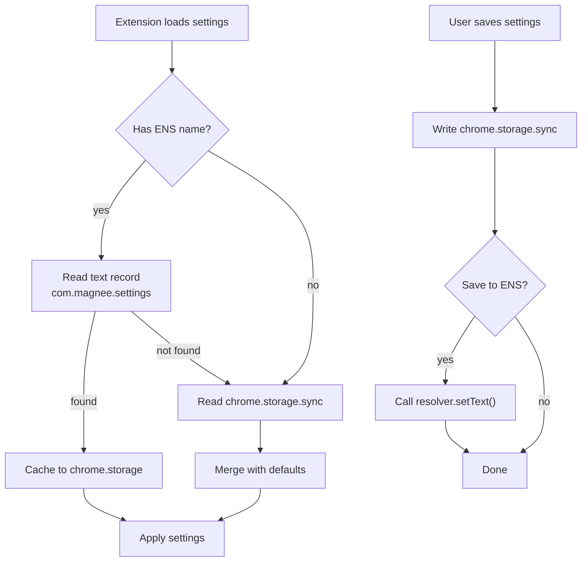

# ENS Integration

Magnee uses [ENS](https://ens.domains) text records to store user settings on-chain, making preferences portable across browsers and devices.

## How It Works



## Settings Schema

[`extension/src/lib/settings/types.ts`](extension/src/lib/settings/types.ts)

```typescript
interface UserSettings {
  interceptionEnabled: boolean;
  theme: 'light' | 'dark';
  preferredTokens: { [chainId: number]: string };
  slippage: number;       // basis points (50 = 0.5%)
  gasLimit?: number;      // multiplier (1.2 = 120%)
  version: 1;
}
```

Stored as minified JSON under the key `com.magnee.settings`.

## Loading Priority

[`extension/src/lib/settings/manager.ts`](extension/src/lib/settings/manager.ts) — The settings manager orchestrates a three-tier fallback:

1. **ENS text records** (if wallet connected and has ENS name)
2. **chrome.storage.sync** (synced across Chrome instances)
3. **Defaults**

```typescript
export async function loadSettings(address?, publicClient?): Promise<UserSettings> {
    // Try ENS first
    if (address && publicClient) {
        const ensSettings = await loadFromENS(address, publicClient);
        if (ensSettings) {
            await saveToExtensionStorage(ensSettings); // cache locally
            return ensSettings;
        }
    }
    // Fall back to chrome.storage
    return await loadFromExtensionStorage();
}
```

## Reading from ENS

[`extension/src/lib/settings/ens.ts`](extension/src/lib/settings/ens.ts) — Reverse-resolves the address to an ENS name, then reads the text record.

```typescript
export async function loadFromENS(address, publicClient): Promise<UserSettings | null> {
    const ensName = await publicClient.getEnsName({ address });
    if (!ensName) return null;

    const settingsJson = await publicClient.getEnsText({
        name: normalize(ensName),
        key: 'com.magnee.settings',
    });

    return parseSettings(settingsJson);
}
```

## Writing to ENS

Same file — `saveToENS()` writes settings via the ENS resolver's `setText` function on mainnet.

```typescript
export async function saveToENS(ensName, settings, walletClient, address): Promise<string> {
    const resolver = await publicClient.getEnsResolver({ name: normalize(ensName) });
    const node = namehash(normalize(ensName));
    const settingsJson = minifySettings(settings);

    return await walletClient.writeContract({
        address: resolver,
        abi: RESOLVER_ABI,  // just setText(bytes32 node, string key, string value)
        functionName: 'setText',
        args: [node, 'com.magnee.settings', settingsJson],
        chain: mainnet,
    });
}
```

## Local Storage

[`extension/src/lib/settings/storage.ts`](extension/src/lib/settings/storage.ts) — `chrome.storage.sync` wrapper with change watching across extension contexts.

```typescript
// Watch for settings changes (e.g. popup writes, settings page reads)
chrome.storage.onChanged.addListener((changes, areaName) => {
    if (areaName === 'sync' && changes['magnee_settings']) {
        callback(changes['magnee_settings'].newValue);
    }
});
```

## Size Constraint

ENS text records have a practical limit. `checkSettingsSize()` validates the minified JSON fits in 255 characters:

```typescript
export function checkSettingsSize(settings: UserSettings): { ok: boolean; size: number } {
    const json = minifySettings(settings);
    return { ok: json.length <= 255, size: json.length };
}
```
