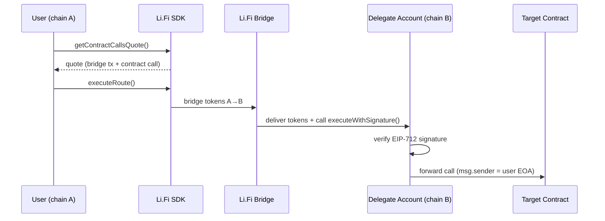

# Li.Fi Integration

Magnee uses [Li.Fi](https://li.fi) for cross-chain bridging with destination contract calls. The user pays with tokens on chain A, Li.Fi bridges to chain B and executes the original transaction on the user's behalf.

## How It Works



## Extension: SDK Setup

[`extension/src/lib/lifi.ts`](extension/src/lib/lifi.ts) — Global SDK configuration.

```typescript
// Initialize with chain-state-isolated transport
createConfig({
    integrator: 'Magnee',
    providers: [
        EVM({
            getWalletClient: async () => currentClient,
            switchChain: async (reqChainId) => {
                // Update internal tracking only — don't fight the dapp
                trackedChainId = reqChainId;
                currentClient = makeClient(reqChainId);
                return currentClient;
            }
        })
    ]
});
```

**Chain State Isolation** — The SDK transport intercepts `eth_chainId` and `wallet_switchEthereumChain` to return Magnee's tracked chain, not the dapp's current chain. This prevents "chain wars" where dapps revert Magnee's chain switches mid-bridge.

## Extension: Quoting

[`extension/src/ui/hooks/useQuoteFetcher.ts`](extension/src/ui/hooks/useQuoteFetcher.ts) — Builds a `getContractCallsQuote` request with the intercepted transaction as the destination contract call.

Key steps:
1. Sign an EIP-712 authorization for cross-chain execution (`signExecuteTypedData`)
2. Encode as `executeWithSignature()` calldata targeting the user's own EOA
3. Request a quote from Li.Fi with the contract call embedded

```typescript
const contractCall = {
    fromAmount: amountDecimal,
    fromTokenAddress: ZERO_ADDRESS,
    toContractAddress: tx.from,      // user's EOA (pre-delegated)
    toContractCallData: contractCallData,
    toContractGasLimit: effectiveGasLimit,
};

const quote = await fetchLiFiQuote({
    fromChain: currentChain,
    toChain: targetChain,
    toAmount: amountDecimal,
    contractCalls: [contractCall],
    slippage,  // from user settings
});
```

## Extension: Route Execution

[`extension/src/lib/lifi.ts`](extension/src/lib/lifi.ts) — `executeLiFiRoute()` converts the quote to a route and executes with real-time status callbacks.

```typescript
const route = convertQuoteToRoute(step);

await executeRoute(route, {
    getContractCalls: async () => ({ contractCalls }),
    updateRouteHook: (updatedRoute) => {
        // Real-time UI updates: step progress, status messages
    }
});
```

## Extension: Token Balances

[`extension/src/lib/tokenBalances.ts`](extension/src/lib/tokenBalances.ts) — Uses `@lifi/sdk` to fetch token lists and balances across chains, cached with TTL.

```typescript
import { getTokens, getTokenBalancesByChain } from '@lifi/sdk';

const tokensResponse = await getTokens({ chains: chainIds });
const balancesResponse = await getTokenBalancesByChain(walletAddress, tokensByChain);
```

Results are sorted by USD value and filtered to non-zero balances.

## Web: Transaction Explorer

[`web/src/lib/explorer.ts`](web/src/lib/explorer.ts) — Queries the Li.Fi status API to trace bridge delivery on destination chains.

```typescript
// Poll Li.Fi status API
const res = await fetch(`https://li.quest/v1/status?txHash=${txHash}&fromChain=${chainId}`);
const { status, substatus, tool, sending, receiving } = await res.json();

// If delivered, fetch destination receipt and decode logs
if (receiving?.txHash) {
    const destReceipt = await destClient.getTransactionReceipt({ hash: receiving.txHash });
    // Analyze delegate execution, target events, bridge events...
}
```

## Scripts: tx-trace

[`scripts/tx-trace.ts`](scripts/tx-trace.ts) — CLI version of the same Li.Fi status tracking for debugging.

## Contract: Signature Verification

[`contracts/src/MagneeDelegateAccount.sol`](contracts/src/MagneeDelegateAccount.sol) — The `executeWithSignature()` function is the on-chain counterpart. Li.Fi's bridge executor calls it on the destination chain, passing the EIP-712 signature that proves the EOA owner authorized this specific execution.

```solidity
function executeWithSignature(
    address target, uint256 value, bytes calldata data,
    uint256 nonce, uint256 deadline, bytes calldata signature
) external payable returns (bytes memory result) {
    // Verify deadline, nonce, EIP-712 digest, ecrecover → must be address(this)
    result = _execute(target, value, data);
}
```
