# Magnee

Cross-chain payment interceptor. Pay for any on-chain transaction with tokens from any supported chain.

A browser extension wraps `window.ethereum`, intercepts payable transactions, and offers to bridge payment from a chain where you hold funds — using Li.Fi for bridging and EIP-7702 for preserving `msg.sender` identity.

```mermaid
flowchart LR
    Dapp["Dapp<br/>(any)"] -->|eth_sendTransaction| PW["Provider Wrapper"]
    PW -->|value > 0?| Popup["Magnee Popup"]
    Popup -->|user picks source chain/token| LiFi["Li.Fi SDK"]
    LiFi -->|bridge + contract call| Dest["Destination Chain"]
    Dest -->|executeWithSignature| DA["Delegate Account<br/>(user's EOA)"]
    DA -->|msg.sender preserved| Target["Target Contract"]
```



## Packages

| Package | Description |
|---------|-------------|
| [contracts/](contracts/) | EIP-7702 delegate account (Solidity/Foundry) |
| [extension/](extension/) | Browser extension — interceptor, bridge UI, wallet bridge |
| [web/](web/) | Landing page + transaction explorer |
| [demo/](demo/) | Test dapp for development |
| [packages/ui/](packages/ui/) | Shared React components |
| [metamask-patch/](metamask-patch/) | MetaMask EIP-7702 patch builder |
| [scripts/](scripts/) | CLI utilities (tx-trace) |

## Key Integrations

- [**LIFI.md**](LIFI.md) — Li.Fi SDK for cross-chain bridging with contract calls
- [**ENS.md**](ENS.md) — ENS text records for portable user settings

## Quick Start

```bash
bun install               # install all workspaces
bun run dev               # start extension + demo + web concurrently
bun run build             # build extension + demo
bun run test              # run extension + contract tests
```

## Supported Chains

Ethereum, Optimism, Base, Arbitrum

## Tech Stack

Bun, Vite, React, TypeScript, Tailwind CSS, viem, wagmi, `@lifi/sdk`, Foundry (Solidity 0.8.33)
